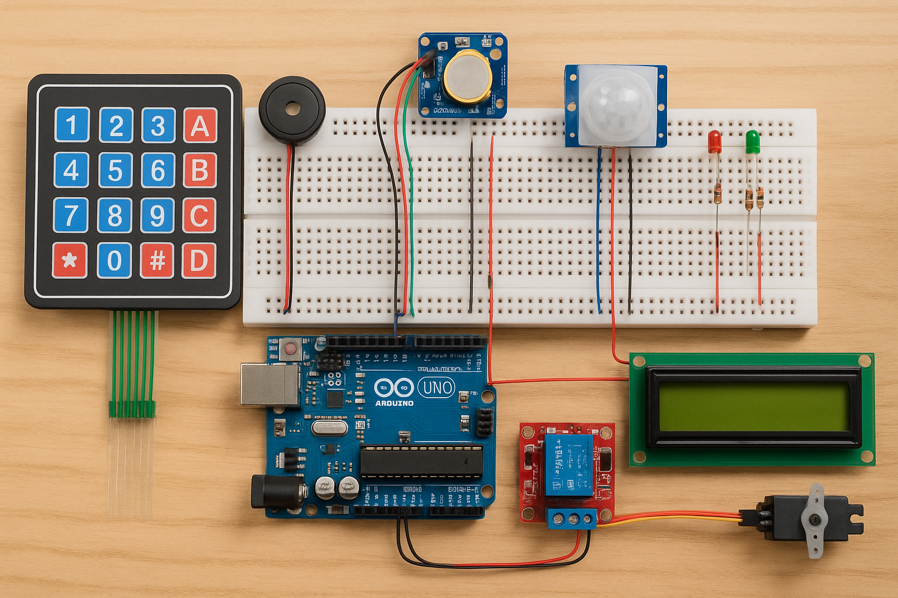
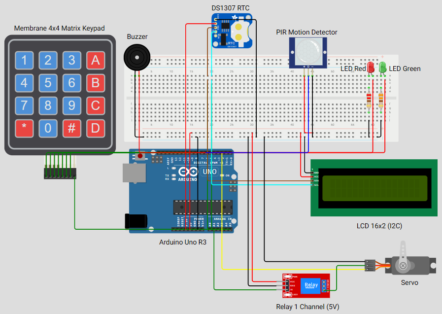
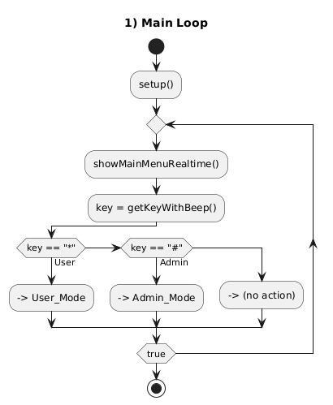
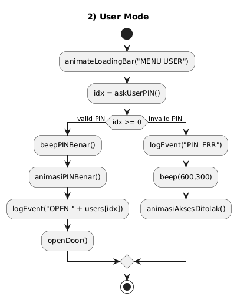
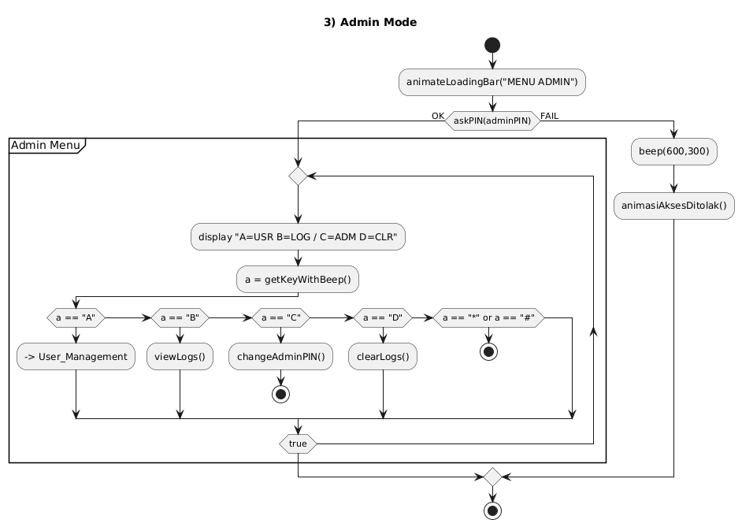
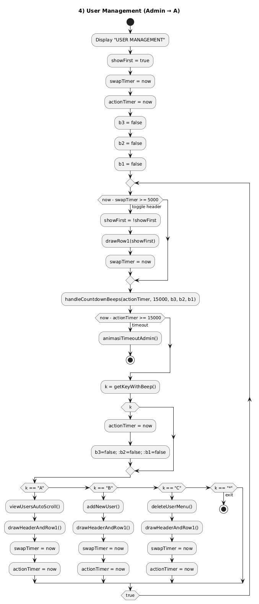

# 🔐 Arduino Door Lock System (Keypad 4x4, I2C LCD, DS3231, Servo + Relay, PIR)

Sistem door lock berbasis Arduino dengan fitur lengkap:
- Keypad 4x4 sebagai input PIN
- LCD 16x2 I2C untuk antarmuka pengguna
- RTC DS3231 untuk timestamp pada log
- Servo digerakkan melalui relay (hemat daya saat idle)
- Sensor PIR untuk menutup pintu otomatis ketika orang lewat
- Manajemen user (lihat/tambah/hapus) + log akses di EEPROM
- UI halus: animasi, anti-flicker, bunyi beep countdown 3-2-1 sebelum timeout

---

## 📸 Demo Project

---

## ✨ Fitur
- PIN user dan admin (4 digit, default admin: 0000)
- Mode User
  - Input PIN → bila benar: pintu terbuka (beep dua nada + animasi), menutup saat PIR mendeteksi
  - Bila salah: animasi akses ditolak + beep
- Mode Admin
  - A = Manajemen User
    - Lihat daftar user auto-scroll tanpa flicker
    - Tambah user (nama otomatis USER-1..USER-10)
    - Hapus user dengan konfirmasi + notifikasi
    - Baris instruksi auto-toggle tiap 5 detik
    - Timeout 15 detik dengan beep countdown 3-2-1 → kembali ke menu utama
    - Tombol “*” keluar ke menu Admin
  - B = Lihat Log (navigasi A/B, keluar D/*/#)
  - C = Ubah PIN Admin
  - D = Clear Log (dengan konfirmasi)
- Log di EEPROM (maks 40 entri), timestamp dari DS3231
- Anti-flicker pada tampilan daftar user dan menu hapus user
- Animasi startup, PIN benar/salah, buka/tutup pintu

---

## 🛠️ Hardware
Ringkasan pin default:
- Servo signal: D2
- Buzzer: D3
- LED hijau: D4
- LED merah: D5
- PIR: D6 (aktif HIGH)
- Keypad rows: D7, D8, D9, D10
- Keypad cols: D11, D12, D13, A0
- Relay control: A1 (aktif LOW)
- LCD I2C: 0x27 (SDA/SCL mengikuti board, Uno: A4/A5)
- RTC DS3231: I2C (SDA/SCL sama dengan LCD)

---

## 📐 Wiring Diagram
Detail wiring: lihat docs/WIRING.md  

---

## 📊 Flowchart
Detail flowchart: lihat docs/FLOWCHART.md

### Halaman 1 – Startup & Menu Utama

### Halaman 2 – Flowchart USER

### Halaman 3 – Flowchart ADMIN

### Halaman 4 – Submenu Admin Detail

---

## 📦 Dependensi
Instal via Arduino Library Manager:
- Keypad
- LiquidCrystal_I2C
- RTClib

Menggunakan library bawaan:
- EEPROM
- Servo

---

## 🚀 Instalasi & Upload
1. Clone repo ini.
2. Pastikan wiring sesuai docs/WIRING.md.
3. Buka `src/DoorLock.ino` di Arduino IDE.
4. Install library dependensi.
5. Pilih board/port, lalu Upload.
6. RTC akan diset ke waktu kompilasi saat pertama kali (jika lost power).

---

## ⚙️ Konfigurasi Cepat
- Alamat LCD: konstruktor `LiquidCrystal_I2C(0x27, 16, 2)` — ubah jika berbeda.
- Posisi servo: `POS_CLOSED` dan `POS_OPEN`.
- Timeout & interval UI:
  - Manajemen user: `SWAP_MS = 5s` toggle instruksi, `TIMEOUT_MS = 15s`
  - Lihat user: interval default 1500 ms per pengguna
- Buzzer: fungsi `beep(f,t)` serta `handleCountdownBeeps()` untuk countdown 3-2-1.

---

## 💾 EEPROM
Detail layout di docs/EEPROM_LAYOUT.md:
- MAX_USERS: 10, PIN 4 digit, nama 12 char
- Admin PIN di EEPROM (default 0000)
- Log: 40 entri × 24 byte

Perhatikan umur tulis EEPROM — hindari operasi write berlebihan.

---

## ▶️ Penggunaan
- Layar utama: baris 0 = waktu RTC, baris 1 = “*USER     #ADMIN”
- Mode User (*) → input PIN user
- Mode Admin (#) → input PIN admin (default 0000)
  - A: Manajemen User (lihat/tambah/hapus; “*” back ke Admin; idle 15s → Main)
  - B: Lihat Log (A/B navigasi; D/*/# back)
  - C: Ubah PIN Admin
  - D: Hapus Log (konfirmasi)

  ---

## 🛠️ Troubleshooting
- LCD kosong: cek alamat I2C, wiring SDA/SCL, kontras.
- RTC salah: pastikan baterai coin; waktu akan auto-set saat lostPower.
- Servo bergetar/reset: gunakan catu daya terpisah; relay ON sebelum gerak, OFF setelah selesai; GND disatukan.
- PIR tidak menutup: pastikan output PIR HIGH saat deteksi di D6.

---

## 🗺️ Roadmap
- Edit nama user
- Opsi durasi auto-close pintu
- Ekspor log via Serial
- Proteksi brute force (lockout)

---

## 📜 Lisensi
MIT License — lihat file LICENSE.

---

## 🙌 Kredit
- RTClib oleh Adafruit
- Komunitas Arduino untuk library Keypad dan LiquidCrystal_I2C
- Semua kontributor
